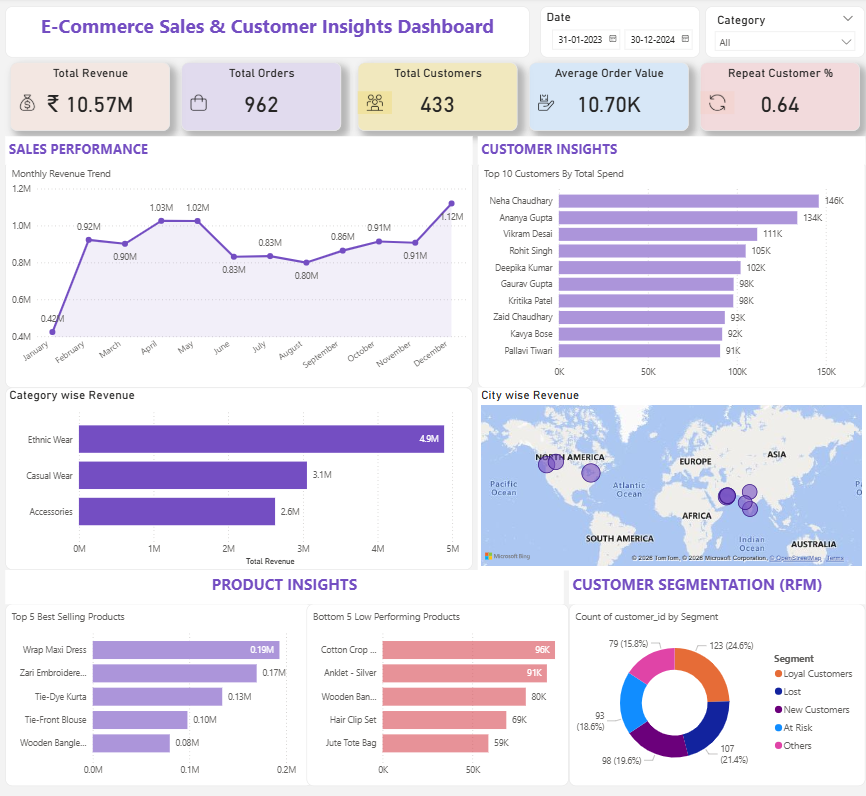

# 📊 E-Commerce Sales & Customer Segmentation Dashboard (RFM Analysis)

## 🔍 Project Overview

This project presents an end-to-end Power BI dashboard analyzing e-commerce sales performance and customer behavior using **RFM (Recency, Frequency, Monetary) analysis**.

The dashboard helps identify high-value customers, at-risk segments, and overall business performance to support data-driven decision-making.

---

## 🎯 Key Objectives

* Analyze overall sales performance
* Identify top customers and products
* Perform customer segmentation using RFM analysis
* Track KPIs like Revenue, Orders, AOV, and Repeat Customer %

---

## 📌 Dashboard Highlights

### 🟣 Sales Performance

* Monthly revenue trend
* Category-wise revenue analysis

### 🟣 Customer Insights

* Top customers by revenue
* Geographic distribution (city-wise revenue)

### 🟣 Product Insights

* Best-selling products
* Low-performing products

### 🟣 Customer Segmentation (RFM)

* Segmented customers into:

  * Champions
  * Loyal Customers
  * New Customers
  * At Risk
  * Lost

---

## 📊 Key KPIs

* **Total Revenue**
* **Total Orders**
* **Total Customers**
* **Average Order Value (AOV)**
* **Repeat Customer %**

---

## 🧠 RFM Analysis Logic

* **Recency** → Days since last purchase
* **Frequency** → Number of orders
* **Monetary** → Total spending

Customers are scored (1–5) and segmented based on their RFM scores.

---

## 🛠️ Tools & Technologies

* Power BI
* DAX (Data Analysis Expressions)
* Data Modeling (Star Schema)
* Data Cleaning

---

## 📁 Dataset

The dataset includes:

* Customers
* Orders
* Order Items
* Products

---

## 📷 Dashboard Preview

---

## 🚀 How to Use

1. Download the `.pbix` file
2. Open in Power BI Desktop
3. Explore dashboard using filters and slicers

---

## 📈 Key Insights

* High-value customers (Champions & Loyal) contribute a major share of revenue
* Certain product categories drive the majority of sales
* A portion of customers are at risk and require re-engagement strategies

---

